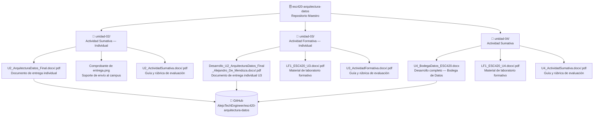

<div align="center">

# 🗄️ ESC420 — Arquitectura de Datos

### Repositorio maestro del módulo · Todas las unidades consolidadas

[](https://www.poligran.edu.co/)
[](https://www.poligran.edu.co/)
[](https://www.microsoft.com/es-co/microsoft-365/word)
[](https://daringfireball.net/projects/markdown/)
[](.)

*Maestría en Arquitectura de Software · Politécnico Grancolombiano*

</div>

---

## ¿Qué es esto?

Repositorio consolidado con todo el trabajo desarrollado a lo largo del módulo **ESC420 — Arquitectura de Datos** de la Maestría en Arquitectura de Software del Politécnico Grancolombiano.

Cada unidad tiene su propia carpeta con los documentos de desarrollo, guías de actividad y soportes de entrega correspondientes. El objetivo de este repositorio es servir como archivo maestro y trazable de todas las entregas del módulo, manteniendo una estructura clara y consistente por unidad.

---

## Arquitectura



---

## Estructura

```
esc420-arquitectura-datos/
│
├── unidad-02/                          # Unidad 2 — Modelo y calidad del dato
│   ├── U2_ArquitecturaDatos_Final.docx         ← Documento de entrega final
│   ├── U2_ArquitecturaDatos_Final.pdf
│   ├── Desarrollo_U2_ArquitecturaDatos_Final.docx
│   ├── U2_ActividadSumativa.docx               ← Guía / rúbrica
│   ├── U2_ActividadSumativa.pdf
│   └── Comprobante de entrega de la atividad desarrollada.png  ← Soporte
│
├── unidad-03/                          # Unidad 3 — Ciclo de vida de la ingeniería de datos
│   ├── Desarrollo_U2_ArquitecturaDatos_Final_Alejandro_De_Mendoza.docx  ← Entrega final
│   ├── Desarrollo_U2_ArquitecturaDatos_Final_Alejandro_De_Mendoza.pdf
│   ├── LF1_ESC420_U3.docx                      ← Material de laboratorio
│   ├── LF1_ESC420_U3.pdf
│   ├── U3_ActividadFormativa.docx              ← Guía / rúbrica
│   ├── U3_ActividadFormativa.pdf
│   └── README.md                               ← Descripción del análisis
│
└── unidad-04/                          # Unidad 4 — Arquitecturas avanzadas — Bodega de Datos
    ├── U4_BodegaDatos_ESC420.docx              ← Desarrollo completo
    ├── LF1_ESC420_U4.docx                      ← Material de laboratorio
    ├── LF1_ESC420_U4.pdf
    ├── U4_ActividadSumativa.docx               ← Guía / rúbrica
    ├── U4_ActividadSumativa.pdf
    └── README.md                               ← Documentación de la entrega
```

---

## Resumen por unidad

| Unidad | Tema | Tipo de entrega | Estado |
|--------|------|-----------------|--------|
| **Unidad 2** | Modelo y calidad del dato | Actividad Sumativa — Individual | ✅ Entregado |
| **Unidad 3** | Ciclo de vida de la ingeniería de datos · ACID vs BASE | Actividad Formativa — Individual | ✅ Entregado |
| **Unidad 4** | Arquitecturas de almacenamiento avanzado — Bodega de Datos | Actividad Sumativa | ✅ Entregado |

---

## Herramientas

```
Politécnico Grancolombiano — Campus Virtual
├── Microsoft Word / PDF   — documentos de desarrollo y entrega
├── Markdown               — documentación del repositorio
└── GitHub                 — control de versiones y archivo maestro
```

---

## Autor

**Alejandro De Mendoza**  
Ingeniero Informático · Especialista en IA · Maestría en Arquitectura de Software  
[@AlejoTechEngineer](https://github.com/AlejoTechEngineer)
